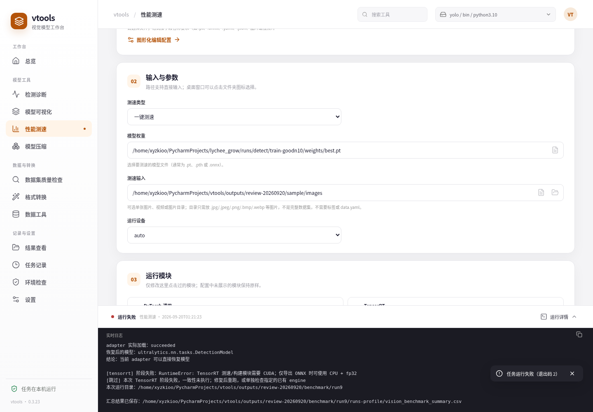
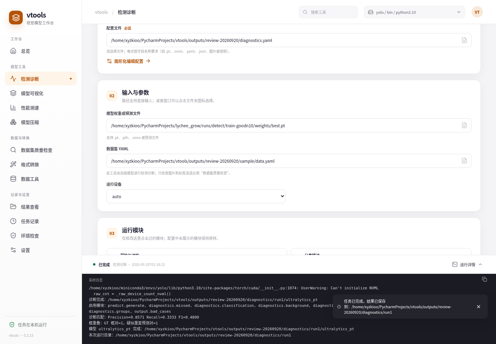
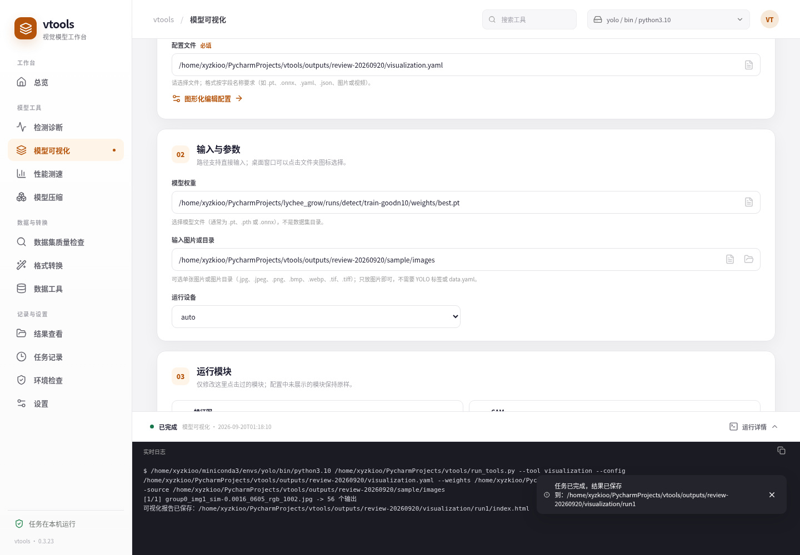
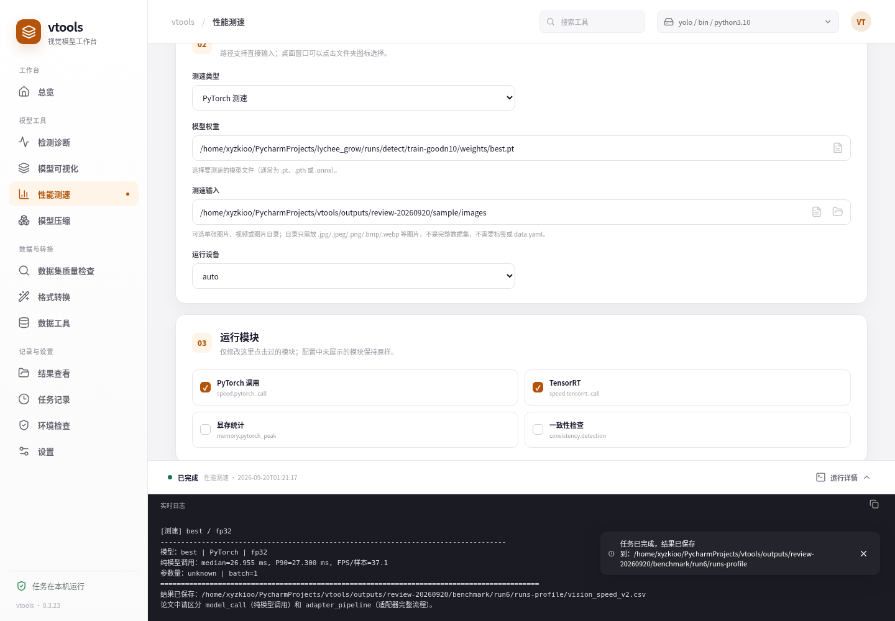
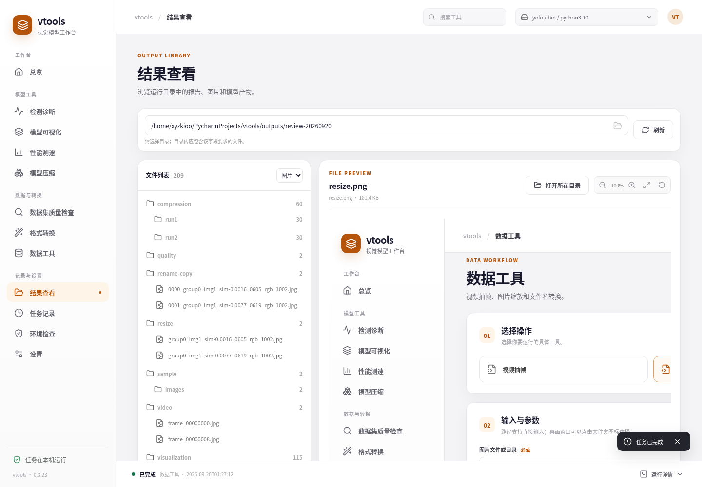

# vtools

> 面向视觉模型开发者的实验、诊断、测速与部署工具箱。

`vtools` 把模型开发中常见的“模型能不能跑、错在哪里、到底快不快、能不能部署”组织成一套可复查的工作流。它提供统一的桌面工作台，也保留 YAML 和命令行入口，适合个人实验、模型迭代和边缘设备部署前验证。

<p align="center">
  
</p>

## 界面预览

<table>
  <tr>
    <td width="50%" align="center">
      <br>
      <strong>检测诊断</strong>
    </td>
    <td width="50%" align="center">
      <br>
      <strong>模型可视化</strong>
    </td>
  </tr>
  <tr>
    <td width="50%" align="center">
      <br>
      <strong>PyTorch 性能测速</strong>
    </td>
    <td width="50%" align="center">
      <br>
      <strong>结果预览</strong>
    </td>
  </tr>
</table>

## 它解决什么问题

- **看清模型为什么错**：定位漏检、错分类、定位偏差、重复框和背景误检，并保留逐图、逐目标和差图证据。
- **看清模型在哪一层出问题**：观察指定层特征、CAM，以及检测头从 raw candidate 到最终框的筛选过程。
- **用一致口径比较速度**：分别测量 PyTorch、TensorRT 的调用边界、显存和输出一致性，减少“测出来但无法复现”的情况。
- **把实验结果留下来**：每次运行自动保存有效配置、日志、报告和模型产物，方便回溯和对比。
- **连接训练代码和部署工具**：支持 Ultralytics 模型、独立 Ultralytics Fork、ONNX、TensorRT 和 K230 转换流程。

## 功能一览

| 模块 | 用途 |
| --- | --- |
| 数据集质量检查 | 独立扫描坏图、标签、尺寸、重复图片和数据划分泄漏，无需加载模型 |
| 检测诊断 | 加载模型或已有预测，分析漏检、错分类、背景误检、重复框、定位偏差、阈值和重叠 |
| 模型可视化 | 指定层特征图、Grad-CAM / LayerCAM、检测头阶段追踪 |
| 性能测速 | PyTorch / TensorRT 固定输入计时、checkpoint 检查、显存统计和跨后端一致性 |
| 模型压缩 | 动态 INT8、非结构化剪枝、结构化通道缩放、知识蒸馏和压缩前后评估 |
| 数据与转换 | NDJSON 转 YOLO、模型转 ONNX / K230 `.kmodel`、ONNX 与 `.kmodel` 校验 |
| 桌面工作台 | 统一配置、运行、日志、历史记录和结果预览；支持 Ubuntu 与 Windows |

## 项目定位

`vtools` 是 Ultralytics 生态的配套工具，不重复实现训练、验证、预测和标准导出等基础能力：

- 常规训练、验证指标、预测和标准格式导出优先使用 [Ultralytics](https://github.com/ultralytics/ultralytics) 的原生接口；
- `vtools` 专注于错误原因分析、候选框和层级追踪、固定边界测速、自定义模型、跨后端对比和 K230 等额外工作；
- 同名指标必须结合输入尺寸、batch、精度和计时范围一起比较。

## 快速开始

### 方式一：使用 Ubuntu `.deb`

从 [Releases](https://github.com/xyzkioo/vtools/releases) 下载对应版本的安装包，然后安装：

```bash
sudo apt install ./vtools_<版本>_<架构>.deb
```

`.deb` 包含 vtools 桌面工作台，但不包含 PyTorch、Ultralytics、模型权重、数据集或 GPU 驱动。安装后，在“设置”中选择实际运行模型任务的 Python 环境即可。

### 方式二：从源码运行

```bash
git clone https://github.com/xyzkioo/vtools.git
cd vtools

conda create -n vtools python=3.10 -y
conda activate vtools
python -m pip install -r vtools_ui/requirements.txt
python -m vtools_ui
```

也可以直接使用已有的训练环境，例如 `yolo`。模型依赖和独立 Fork 的配置见[环境检验向导](env_test/README.md)。

### 第一次检查环境

从仓库根目录运行：

```bash
python env_test/check_install.py --source ../ultralytics-ezcn
```

检查器会验证当前 Python、PyTorch、Ultralytics 实际导入路径、核心依赖、CUDA、模型构建和一次前向传播。需要检查 ONNX / TensorRT 时增加 `--check-export`；需要验证自己的权重时增加 `--weights /path/to/best.pt`。

## 接入独立 Ultralytics Fork

Fork 与 vtools 保持为两个并列仓库，不复制进 vtools，也不会被 vtools 强制安装：

```text
workspace/
├── vtools/
└── ultralytics-ezcn/
```

在 YAML 中指定 Fork：

```yaml
project:
  root: ../..
  ultralytics_repo: ../ultralytics-ezcn
```

也可以临时使用环境变量：

```bash
export VTOOLS_ULTRALYTICS_REPO=../ultralytics-ezcn
```

目录仍叫 `ultralytics-cn` 也可以，只需把路径替换成实际目录。Fork 保持 Python 导入名 `ultralytics`，详细安装和源码说明见 [ultralytics-ezcn](https://github.com/xyzkioo/ultralytics-ezcn)。
安装版工作台运行检测诊断时，还会从所选数据集 YAML 或权重的工作区查找这些同级目录。
“数据集质量检查”是独立入口，只扫描图片和标签，不加载模型。

## 常用入口

所有命令默认从 vtools 仓库根目录运行：

```bash
# 桌面工作台
python -m vtools_ui

# 检测诊断
python run_tools.py --tool diagnostics --config model_diagnostics/config/config.yaml

# 模型可视化
python run_tools.py --tool visualization --config model_visualization/config/config.yaml

# PyTorch / TensorRT 测速
python run_tools.py --tool pytorch --config speed_test/benchmark_config.yaml

# 模型压缩
python run_tools.py --tool compression --config model_compression/config/config.yaml
```

配置文件是模型工具的完整参数来源；命令行和桌面界面只覆盖本次运行需要修改的字段。使用具体入口前，可先查看帮助：

```bash
python model_diagnostics/run_model_diagnostics.py --help
python model_visualization/run_visualization.py --help
python speed_test/run_all.py --help
python model_compression/run_model_compression.py --help
```

## 结果与复现

每次运行都会创建独立的 `runN` 目录，通常包含：

- `effective_config.json`：本次实际生效的完整配置；
- `summary.json`：汇总指标、状态和产物索引；
- `run_info.json`：输入、环境、模块和运行信息；
- 报告、差图、CSV、HTML 和模型产物。

运行结果、缓存、权重和数据集不属于源码提交内容。工具默认只读取用户输入，生成物写入对应的 `runs/`、`outputs/` 或用户指定目录。

## 项目结构

```text
vtools/
├── vtools_ui/             # React + pywebview 桌面工作台
├── env_test/              # 环境和源码来源检查
├── model_diagnostics/     # 检测质量与错误原因分析
├── model_visualization/   # 特征、CAM 和检测阶段可视化
├── speed_test/            # PyTorch / TensorRT 测速与一致性
├── model_compression/     # 量化、剪枝和蒸馏
├── transform_tools/       # 数据、ONNX 和 K230 转换
├── config/                # 统一入口配置
└── packaging/             # 桌面包和 Ubuntu `.deb` 构建
```

独立 Ultralytics Fork 位于 vtools 同级目录，不在上述源码树内。

## 文档导航

| 文档 | 内容 |
| --- | --- |
| [桌面工作台](vtools_ui/README.md) | UI 启动、桌面包和软件更新 |
| [环境检验向导](env_test/README.md) | Python、PyTorch、CUDA 和 Ultralytics Fork 配置 |
| [检测诊断](model_diagnostics/README.md) | 数据集检查、错误类型和诊断报告 |
| [模型可视化](model_visualization/README.md) | 特征图、CAM 和阶段追踪 |
| [性能测速](speed_test/README.md) | PyTorch、TensorRT 和一致性检查 |
| [模型压缩](model_compression/README.md) | 剪枝、量化、蒸馏和 YOLO 检测压缩 |
| [数据与 K230 转换](transform_tools/REQUIREMENT.md) | NDJSON、ONNX、nncase 和 `.kmodel` |
| [桌面包构建](packaging/README.md) | PyInstaller、Ubuntu `.deb` 和 Release 发布 |

## 许可证

vtools 使用 [MIT License](LICENSE)。独立的 [ultralytics-ezcn](https://github.com/xyzkioo/ultralytics-ezcn) 仓库遵循其自身的许可证和源码授权声明。
