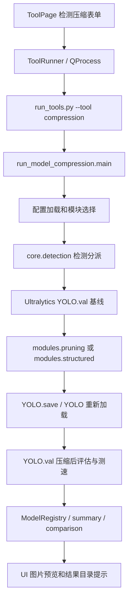

# YOLO 目标检测压缩 Spec

状态：P0 检测基线/非结构化剪枝已接入，结构化通道缩放和 `torch-pruning` 依赖感知通道剪枝已接入并支持可选微调和固定输入测速；已用真实 YOLO 权重和多框数据集完成 CPU 烟测。TensorRT 量化仍在后续阶段；检测蒸馏优先使用 Ultralytics 原生接口。
日期：2026-09-17
范围：`vtools_ui/`、`run_tools.py`、`model_compression/`。  
关联：[原分类压缩 Spec](model-compression.md)。本文新增检测流程，分类流程继续保留。

## 1. 问题和交付目标

用户使用 YOLO 检测权重和 `images/labels` 数据集，一张图片可有多个框、多个类别。原压缩流程通过 `torchvision.datasets.ImageFolder` 读取数据，并使用分类准确率评测，无法处理该输入。修改错误提示没有解决检测压缩需求。

交付目标：选择 YOLO 权重与 `data.yaml` 后，能完成基线检测评估、检测模型压缩、产物重新加载、压缩后检测评估，并查看结果图片和输出位置。多目标标注按原样保留，不转成每图单标签分类。

分阶段交付：

| 阶段 | 内容 | 完成判定 |
|---|---|---|
| P0：检测剪枝闭环 | YOLO 数据入口、基线、非结构化 L1 剪枝、保存与重载、mAP 对比 | 真实多框数据集和真实权重端到端通过 |
| P0.5：结构化通道缩放 | 根据 Ultralytics YAML 的规模表重建 dense 网络、迁移匹配权重、可选微调、mAP 与固定输入延迟对比 | 生成更小结构的 `.pt`，重载后完成检测评估并记录参数量、文件大小和延迟 |
| P0.6：依赖感知通道剪枝 | 使用 `torch-pruning.DependencyGraph` 删除主干/颈部阶段通道，同步调整卷积、BN、Concat 和残差依赖 | 生成可重载的 dense `.pt`，检测头输出契约保持不变，并记录被剪层与真实延迟 |
| P1：部署量化 | TensorRT FP16/INT8、校准集选择、引擎验证、目标设备测速 | 实际生成部署产物并实测大小、精度、延迟 |
| P2：检测蒸馏接入 | 调用 Ultralytics `distill_model` 训练，记录教师/学生来源和验证结果 | 原生训练产物可重载，并完成同一数据集上的 mAP 验收 |

非结构化 P0 属于稀疏化压缩：权重变为零，不保证普通稠密 PT 文件变小、参数总数变少或推理加速。结构化 P0.5 通过 YAML 的 depth/width scale 重建更小的 dense 网络，参数量和文件大小应下降，但实际延迟仍必须在目标设备上实测。界面和报告必须区分两种结果，不能将置零冒充通道删除。

## 2. 输入与数据契约

必需输入：

- `model.weights`：本地 Ultralytics 可加载的检测 `.pt` 权重。
- `model.task: detect`：独立检测任务；加载后检查 `YOLO(...).task == "detect"`。
- `dataset.data`：包含类别名称和数据划分的 YOLO YAML。
- `evaluation.split`：默认 `val`；同一次压缩前后必须使用相同划分与参数。

示例目录：

```text
dataset/
  data.yaml
  train/images/a.jpg
  train/labels/a.txt
  val/images/b.jpg
  val/labels/b.txt
```

```yaml
path: /absolute/path/to/dataset
train: train/images
val: val/images
names:
  0: unripe
  1: semi-ripe
  2: ripe
```

每个标签文件保留全部 `class_id x_center y_center width height` 行。空背景图按 Ultralytics 规则处理。数据格式解析和检测 batch 构建复用 Ultralytics，不经过 ImageFolder，不自行推断类别名。

旧 UI 的 `train` / `val` 路径可兼容查找该目录及父目录中的 `data.yaml` / `data.yml`。找到多份时要求明确选择，找不到时提示提供 YAML。显式 `dataset.data` 优先；它存在时不得悄悄混用另一个数据集的 train/val。

## 3. UI 与 CLI 接口

压缩页面增加模型任务选择：`YOLO 目标检测` / `图像分类`。检测模式显示权重、检测数据集 YAML、设备、剪枝比例、评估输入尺寸；分类模式保留 ImageFolder 入口。

检测模式常用模块：基线评估、非结构化剪枝、结构化通道缩放、依赖感知通道剪枝。结构化方法由 `compression.structured.method` 选择：`scale` 使用 YOLO 规模重建，`torch_pruning` 使用依赖图物理删除通道。分类动态 INT8 和分类蒸馏在检测模式禁用；后续检测量化使用独立模块 ID。检测蒸馏调用 Ultralytics 原生 `distill_model`，如需接入工作台，仅包装配置、运行目录和报告。

命令示例（P0）：

```bash
python run_tools.py --tool compression \
  --config model_compression/config/config.yaml \
  --task detect \
  --weights /absolute/path/to/best.pt \
  --data /absolute/path/to/data.yaml \
  --device cpu \
  --structured-scale n \
  --structured-initial-weights /absolute/path/to/yolo26n.pt \
  --structured-epochs 80 \
  --only compression.prune.structured \
  --only comparison.report
```

| UI 输入 | CLI 参数 | 有效配置 |
|---|---|---|
| 模型任务 | `--task detect` | `model.task` |
| 模型权重 | `--weights` | `model.weights` |
| 检测数据集 | `--data` | `dataset.data` |
| 运行设备 | `--device` | `model.device` |
| 勾选模块 | 重复 `--only` | 模块选择器生成执行集合 |
| 图形配置剪枝比例 | YAML | `compression.sparsity` |
| 结构化目标规模与微调轮数 | YAML | `compression.structured.target_scale`、`compression.structured.finetune_epochs` |
| 结构化目标规模与微调轮数临时覆盖 | `--structured-scale`、`--structured-epochs` | 本次运行的 `compression.structured.*` |
| 结构化初始化权重临时覆盖 | `--structured-initial-weights` | 本次运行的 `compression.structured.initial_weights` |
| 结构化剪枝方法临时覆盖 | `--structured-method scale|torch_pruning` | 本次运行的 `compression.structured.method` |
| 依赖感知结构化方法 | YAML | `compression.structured.method: torch_pruning` |
| 依赖感知通道比例/对齐 | YAML | `compression.structured.channel_sparsity`、`channel_round` |

覆盖顺序：本次 CLI/UI 显式输入 > YAML > 默认值。本次覆盖不得修改用户原 YAML。

## 4. 调用链和模块职责



| 项目模块 | 接口/函数 | 职责 |
|---|---|---|
| `vtools_ui/webapp/frontend/src/App.tsx` | 压缩工具页 | 收集检测输入并提交结构化运行请求 |
| `vtools_ui/webapp/core.py` | `build_command()` | 校验输入并构造所选 Python 的压缩命令 |
| `vtools_ui/webapp/tasks.py` | `TaskManager.start()` | 启动子进程、接收输出与退出码 |
| `run_tools.py` | `main()` | 将 `--weights/--data/--task/--device` 转发给压缩入口 |
| `model_compression/core/config.py` | `load_config()`、`apply_python_paths()` | 解析相对路径、应用源码路径 |
| `model_compression/core/module_selection.py` | `resolve_compression_modules()` | 验证模块 ID 和选择冲突 |
| `model_compression/core/detection.py` | `is_detection()` | 路由到检测流程，兼容旧 YOLO 目录输入 |
| 同上 | `detection_data()` | 解析显式或兼容发现的 data.yaml |
| 同上 | `load_detector()` | 校验本地文件并加载检测模型 |
| 同上 | `evaluate_detector()` | 调用检测验证，返回 mAP/Precision/Recall |
| 同上 | `run_detection_operation()` | 执行检测基线、参数统计、剪枝、导出 |
| `model_compression/modules/pruning.py` | `prune_unstructured()` | 复用全局 L1 剪枝与实际稀疏度统计 |
| `model_compression/modules/structured.py` | `build_structured_detector()`、`finetune_structured_detector()` | 按 Ultralytics `scales` 重建较小检测网络、迁移匹配权重并可选微调 |
| `model_compression/modules/dependency_pruning.py` | `prune_detector_dependency_aware()` | 建立 `torch-pruning.DependencyGraph`，物理删除阶段通道并同步依赖层 |
| `model_compression/core/run_manager.py` | `prepare_run_directory()`、`write_json()` | 独立运行目录和汇总报告落盘 |
| `model_compression/run_model_compression.py` | `_run_comparison()` | 检测指标差值与产物对比 |

`core/detection.py` 已实现检测分派；结构化路径仍需在目标硬件和正式数据集上完成最终精度/延迟验收。

## 5. 使用的外部接口

### 5.1 P0：检测加载、验证、剪枝、保存

```python
from ultralytics import YOLO
from torch.nn.utils import prune

model = YOLO(weights_path)
metrics = model.val(
    data=data_yaml,
    split="val",
    imgsz=640,
    batch=1,
    device="cpu",
    workers=0,
    conf=0.001,
    iou=0.7,
    plots=True,
    project=run_directory,
    name="baseline_validation",
    exist_ok=True,
)
```

- 检测指标取 `metrics.box.map50`、`metrics.box.map`、`metrics.box.mp`、`metrics.box.mr`。
- `prune_unstructured()` 内部调用 `prune.global_unstructured(..., pruning_method=prune.L1Unstructured, amount=sparsity)`，随后 `prune.remove()` 固化权重。
- 作用于 Conv/Linear 权重，支持 `compression.exclude` 排除层；检测头是否排除属于显式实验配置。
- 用 `YOLO.save(path)` 保存检测 checkpoint，再用 `YOLO(path)` 重新加载进行完整验证。

### 5.2 P0.6：依赖感知结构化剪枝

```python
import torch_pruning as tp

graph = tp.DependencyGraph().build_dependency(
    model.model,
    example_inputs=torch.zeros(1, 3, 640, 640, device=device),
    output_transform=lambda output: output[0] if isinstance(output, (tuple, list)) else output,
)
group = graph.get_pruning_group(
    stage_conv,
    tp.prune_conv_out_channels,
    idxs=channels_to_remove,
)
group.prune()
```

当前实现只把 YOLO 主干/颈部的阶段输出卷积作为根层，检测头输出层和输入 stem 保留；
依赖图负责同步修改后续卷积输入、BatchNorm、Concat、残差分支和深度可分离卷积。
默认 `channel_sparsity=0.10`、`channel_round=8`、最多 6 个阶段，之后仍需按同一数据集
微调并通过 mAP50-95 门禁。该模式需要 `torch-pruning>=1.4.1`，缺少依赖时不会静默退化为
非结构化剪枝。
- 保存前清除旧 EMA/优化器状态，避免旧 EMA 覆盖剪枝结果；不得覆盖用户输入权重。
- 验证可发生融合、精度转换，必须评估模型副本；压缩原始结构，不压缩已被验证流程原地修改的副本。
- 剪枝后精度评估针对保存并重新加载的文件，不能只评估内存对象。

接口依据为仓库中的 `ultralytics-cn/ultralytics/engine/model.py` 和 `model_compression/modules/pruning.py`。实际任务使用环境内导入的 Ultralytics，必须记录其版本和 `__file__`；本地自定义 YOLO 层需要通过 `project.python_paths` 加入匹配源码。

### 5.2 P0.5：结构化通道缩放（已接入）

结构化路径使用源模型 `model.yaml` 中的 `scales` 表，根据 `compression.structured.target_scale` 生成新的 Ultralytics 检测 YAML。新网络的卷积通道和深度会实际减少，输出仍保留原数据集类别数和检测头契约；随后将形状匹配的权重迁移到新网络。

默认配置如下：

```yaml
compression:
  structured:
    target_scale: n
    initial_weights: /absolute/path/to/yolo26n.pt
    finetune_epochs: 80
    train_input_size: 640
    batch_size: 2
    learning_rate: 0.001
    benchmark_warmup: 5
    benchmark_repeats: 20
    quality_gate: true
    max_map50_95_drop: 0.05
```

`initial_weights` 可填写目标规模对应的预训练权重，例如 `yolo26n.pt`，这样可以把目标网络的骨干权重先迁移过来；留空时会在仓库或源模型项目的 `weights/` 目录自动寻找对应文件，找不到才从源模型按形状匹配。`finetune_epochs: 0` 只构建、保存和测速，适合先检查结构；正式使用建议使用与原模型相近的训练预算（当前示例为 80 轮）并重新验证。默认精度门禁要求 mAP50-95 下降不超过 0.05，未通过时将结果标记为失败且不能作为后续阶段输入；可将 `quality_gate: false` 用于保留纯实验结果。产物统一写入 `artifacts/structured_pruning/`，报告包含源/目标参数量、参数下降比例、初始化权重迁移数量、压缩前后 mAP 以及同设备同输入尺寸的中位延迟和 P95 延迟。

当前仓库配置是针对 `train-goodn10/best.pt` 的第一套平衡参数：训练尺寸沿用原模型的 1024，batch size 为 2，优化器显式设为 AdamW，避免 Ultralytics 的 `optimizer=auto` 忽略学习率。换用其他模型时，应从该模型自己的训练配置重新设置这些值。

如果将 `target_scale` 设置为与源模型相同的规模（例如 `s→s`），流程会进入对照模式：网络参数量不变，只重新执行指定的微调和测速，用于区分训练参数影响与结构缩放影响。该模式不会被当作压缩收益。

该实现是基于官方 YAML 规模表的结构化宽度/深度缩放，适合带 `scales` 的 Ultralytics YOLO 模型。它不声称可以对任意自定义网络做依赖图级别的逐层通道裁剪；若未来需要保留任意层组合并自动传播通道索引，再单独增加经过显存和检测头验证的 graph-pruning 后端。

### 5.3 P1：TensorRT 部署量化（待实现）

新增模块 ID：`compression.quantize.tensorrt_fp16`、`compression.quantize.tensorrt_int8`。新增实现文件建议为 `model_compression/modules/detection_quantization.py`。

调用 `YOLO.export(format="engine", ...)` 生成引擎，使用 `YOLO(engine_path, task="detect").val(...)` 做检测精度验收。导出前将实验副本放入本次运行目录，所有转换文件都落在该目录内。

版本适配必须明确：本仓库 Ultralytics 的 `Model.export()` 文档使用 `quantize=16/8`；某些环境版本使用 `half=True` 或 `int8=True`。启动时检查实际导入版本/配置支持情况，由单一兼容层选择参数，不在生产运行中盲试多套参数。

INT8 必须显式提供校准数据，默认只用训练划分，记录抽样规则与数量；禁止缺失数据时自动下载默认数据集。检测验证划分不参与默认校准。

不复用分类 `quantize_dynamic_int8()` 作为 YOLO 卷积量化。模型压缩模块负责产物，性能验证复用 `speed_test/backends/pytorch_vision_tensorrt_benchmark_v2.py` 与 `speed_test/checks/vision_consistency.py`。输出一致性不能替代 mAP 验证。

TensorRT 路径需要匹配的 NVIDIA GPU、CUDA、TensorRT；Windows/Ubuntu UI 均可用，不代表所有环境都能构建引擎。引擎版本不允许继续送入 PT 剪枝/训练模块。

### 5.4 P2：检测知识蒸馏（原生接口）

Ultralytics 已提供 `YOLO(student_weights).train(data=..., distill_model=teacher_weights, ...)`。检测蒸馏先直接使用该接口，不在 vtools 中另建检测 Trainer、特征 hooks、损失和 checkpoint 逻辑。若将其加入压缩工作台，新增代码只负责参数传递、运行目录、模型来源记录和训练后 `YOLO.val()` 验收；分类 `distillation.classification` 不用于检测模型。

## 6. P0 配置示例

```yaml
schema_version: 1
project:
  root: ../..
  python_paths: []
run:
  enabled: true
  root: ./model_compression/runs
  name: auto
model:
  name: yolo_detector
  task: detect
  adapter: torch
  weights: /absolute/path/to/best.pt
  device: auto
dataset:
  data: /absolute/path/to/data.yaml
  input_size: [640, 640]
compression:
  sparsity: 0.30
  exclude: []
  structured:
    target_scale: n
    # 留空时会在项目 weights/ 或源模型项目中自动寻找 yolo26n.pt
    initial_weights: ''
    finetune_epochs: 80
    train_input_size: 1024
    batch_size: 2
    learning_rate: 0.001
    optimizer: AdamW
    benchmark_warmup: 5
    benchmark_repeats: 20
evaluation:
  split: val
  batch_size: 1
  conf: 0.001
  iou: 0.7
export:
  path: null
modules:
  baseline.evaluate: true
  compression.prune.unstructured: true
  compression.prune.structured: false
  comparison.report: true
  artifact.export: false
```

`task: detect` 路由优先于历史默认 `adapter: torch`，不经过分类评估。每次运行只使用当前配置显式提供的权重；要处理其他模型，启动新的 runN 并传入新的 `model.weights`。

## 7. 输出与异常契约

每次使用独立 `model_compression/runs/runN/`：

```text
runN/
  effective_config.json
  summary.json
  baseline_validation/             # 验证图表和检测样例
  before_unstructured_pruning/
  after_unstructured_pruning/
  before_structured_pruning/
  after_structured_pruning/
  artifacts/
    structured_pruning/
      yolo-structured.pt
      structured-<scale>-vtools.yaml
    unstructured_pruning/
      yolo-unstructured-l1.pt
    distillation/
    quantization/
    multi_processing/
```

报告字段至少包括：公共模型信息、数据 YAML 与验证参数、mAP50、mAP50-95、Precision、Recall、剪枝比例/实际零值比例、文件大小、重载结果、模块错误。产物路径使用相对于 runN 的路径；完整配置和环境信息只在 `effective_config.json` 或 summary 的公共模型段保留，不重复写入每个阶段。

mAP 使用 0–1 数值，精度差值为 `after - before`。报告分别列出稀疏度、文件缩小比例和实测速度，未知值为空。速度测试只有在同设备、同输入和同计时口径下可比较。

退出码 0 表示所有所选模块完成；任意模块失败返回非零并保存具体原因。基线失败不得继续执行依赖其结果的变换。压缩后重载/验证失败时保留调试文件，但不得把失败产物作为后续阶段输入。跨运行继续处理时，将上一运行 summary 中的相对 artifact 路径与该 runN 目录拼成实际路径，再传入 `model.weights`。

UI 的结果页只预览图片。数据报告保存在磁盘；任务结束提示状态和目录，失败额外显示本次错误，不能读取上一次任务的错误作为原因。

## 8. 验收用例与当前差距

P0 验收：

1. 一张图片两个以上不同类别的框正常参与验证；标签没有被转成单标签。
2. 显式 data.yaml、旧目录自动发现、多个候选、缺失文件四种情况均按契约处理。
3. UI 正确转发 `--task detect --weights --data`；检测模式禁用分类 INT8/分类蒸馏。
4. 剪枝前后使用同一数据和验证参数，输出四项检测指标；基线与直接调用 YOLO.val 一致。
5. 原始权重校验和不变；稀疏度符合设定；保存的 checkpoint 可在新进程加载，至少完成一次有标签验证。
6. 压缩后出现精度下降也如实报告；不以“文件成功写出”替代验证。
7. 换权重启动新的 runN；失败不作为后续阶段输入；重复运行不覆盖产物。
8. 分类原有测试继续通过；Ubuntu 实测，Windows 至少完成路径/子进程兼容检查并单独记录未实测项。

截至本文编写：检测入口、基线/非结构化剪枝/结构化缩放/导出分派、UI 任务切换和 `data.yaml` 输入已接入；结构化路径支持按 YAML 规模重建网络、可选微调、保存重载、mAP 对比和固定输入测速；独立运行目录、扁平 summary、唯一产物和失败退出码已接入。真实 GPU/TensorRT、完整训练和 Windows 端到端验收仍需在对应环境执行，不能由本地无依赖单元测试代替。
